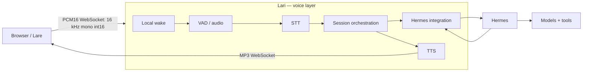

<p align="center">
  
</p>

# Lari

**Lari** — **A self-hosted hands-free voice satellite for Hermes**. It connects to [Hermes](https://github.com/NousResearch/hermes-agent). A phone browser acts as a microphone and speaker; Hermes remains the assistant brain. Each satellite is a **Lare**, represented by the five-state flame mascot. A dedicated hardware satellite is future work.

> **Wake phrase:** one setting drives the whole pipeline. `LARI_WAKE_PHRASE` (default `ehi lari`, or `hey lari` for a non-Italian `LARI_STT_LANG`) rebuilds the command regex, the Vosk wake grammar, the junk cleanup and the provider keyterms automatically. The environment-variable prefix was renamed to `LARI_*`. Existing installs must rename the keys in their private `.env`, keeping values unchanged. Test fixtures are synthetic: real-voice calibration data is per-installation and never committed. A new phrase still deserves real-voice calibration: replay real recordings through the gate and add the observed ASR variants to `LARI_WAKE_ALIASES`.

## The name

Roman households kept Lares (Latin singular Lar; Italian Lare, plural Lari): the spirits who watched over the hearth and the family — every home had its own. The project is named Lari after them. Each satellite is a Lare — the device's proper name: a small hearth-spirit in flame form that keeps you company and answers when you call.

In the project artwork the Lare rides on the shoulder of Hermes — the satellite and its brain.

## How it works



Lari does not contain its own assistant or LLM backend. Every assistant request
passes through Hermes, including the optional Hermes CLI fallback. Hermes owns
model selection, conversation execution and tools. Local wake, STT and TTS
components exist because Lari is the voice layer; configured cloud speech
providers serve that same role. A future client can use the same WebSocket
protocol. The browser/PWA remains the reference satellite.

`server.py` is the transport adapter and the composition root: it owns the
FastAPI/WebSocket surface and loads the settings once, then passes them
explicitly to the runtime components. The session object owns the per-satellite
state and orchestration and is transport-agnostic, so another client could drive
the same voice pipeline without changing it.

The browser displays **idle, listening, thinking, speaking and error** using individually derived animated SVG assets; `scripts/derive_mascot_states.py` rebuilds them from the editable animated source `static/assets/lare-concept.svg` (which doubles as the state-cycle demo at `/<token>/assets/lare-concept.svg`). Each asset carries only its own state's motion. `waking` and `recording` use the listening illustration, while `transcribing` uses thinking. A separate status badge distinguishes local pre-wake monitoring, the local no-wake follow-up window, pending post-wake STT, and audio actually sent to ElevenLabs. The paid-audio indication comes from the bridge **after a successful Realtime audio send**, not from a mascot state or an assumed provider connection; it is not an ElevenLabs balance or billing estimate. The wake phrase displayed in the UI comes from the initial WebSocket state frame—not from the brand or a static string. The bridge does not open a provider connection until the local wake gate confirms the utterance.

## WebSocket protocol

Connect to `/<token>/ws`. Outgoing text frames are JSON objects with `type`;
all names and fields below preserve the browser's existing contract. Semantic
states are `idle`, `listening`, `waking`, `recording`, `transcribing`, `thinking`,
`speaking`, `error`: they describe the interaction, without exposing which STT
engine, SSE connection or TTS request is active. `stt_status` separately reports
whether captured audio was sent to realtime STT or kept local.

| Lari → browser type | Fields | Meaning |
| --- | --- | --- |
| `state` | `state`; optional `turn`, `followup`, `phrase`, `provider`, `voice`, `sensitivity`, `confirm_frames`, `interrupted`, `note`, `error` | Semantic state; initial frame includes wake/voice configuration |
| `partial_transcript` | `text`, `turn` | Provisional transcript; empty text clears it |
| `transcript` | `text`, `turn`; optional `command` | Final user text, optionally wake-stripped |
| `reply` | `text`, `turn` | Assistant reply from Hermes |
| `stt_status` | `mode` (`local` or `realtime`), `turn` | Actual audio transport status |
| `audio_start` | `turn` | Start segmented MP3 playback |
| `audio_chunk` | `turn`, `seq` | Metadata for the next binary MP3 frame, ordered from zero |
| `audio_end` | `turn` | No further segments for this reading |
| `audio` | `fmt` (`mp3`), `bytes`, `turn` | Metadata for the next single binary MP3 frame |
| `followup` | `seconds`; optional `interrupted` | Local conversation window without a new wake phrase |
| `interrupt_ack` | `turn`, `status` (`interrupted`), `echo_tail_ms` | Active turn cancelled; wait for the speaker echo tail |
| `interrupt_rejected` | `turn` | No matching active turn to interrupt |
| `pong` | `state` | Liveness response with semantic state |
| `approval` | `turn`, `approval` | Hermes approval event |
| `fatal` | `error` | Session cannot start its wake engine |

| Browser → Lari | Fields / format | Meaning |
| --- | --- | --- |
| Binary audio | PCM16 little-endian, 16 kHz mono int16 | Microphone frames |
| `ping` | JSON `type` | Request `pong` |
| `playback_done` | JSON `type`, `turn`, optional `status` (`completed` by default or `failed`) | Acknowledge actual browser playback; completion opens follow-up |
| `interrupt` | JSON `type`, `turn` | Cancel the matching active turn |
| `diag` | JSON `type`; `ctx`, `rate`, `mic`, `frames`, `vis`, `raw` | Browser microphone diagnostics |

Turn identifiers prevent stale playback/interruption events from affecting a
new turn. Legacy playback acknowledgements without `turn` remain accepted.
Unknown controls and malformed JSON are ignored. All outgoing messages are
constructed in `lari/protocol.py` with named parameters.

## Quick start

Requirements: Python 3.11/3.12, Hermes with the API server enabled, a separately downloaded Italian Vosk model, and HTTPS for mobile microphone access (localhost is exempt). A Hermes source/install tree is needed only by the optional features that use it: the Hermes/openWakeWord wake engine and the Hermes CLI fallback taken when the API cannot be reached. Normal operation goes through `LARI_HERMES_API`.

Run `./setup.sh` to automate everything below (virtualenv, dependencies, Italian Vosk model, a generated `LARI_TOKEN` in `.env`), or do it by hand:

```bash
git clone https://github.com/matteo-genovese/lari.git
cd lari
python -m venv .venv
. .venv/bin/activate
pip install -r requirements.txt
cp .env.example .env
```

- Download an Italian Vosk model; place its extracted folder at `models/vosk-model-small-it-0.22/` or set `LARI_VOSK_MODEL_DIR` to its absolute path. Verify `am/final.mdl` exists inside. Downloaded models are ignored by Git.
- Generate a unique URL token with `python -c 'import secrets; print(secrets.token_urlsafe(32))'` and put it in `LARI_TOKEN` in `.env`. Never commit that file or disclose the token.
- Configure `LARI_HERMES_API` and `LARI_HERMES_KEY` as required by your Hermes installation — this is the normal path. Set `LARI_HERMES_ROOT` only for the optional features that need a Hermes source/install tree (the openWakeWord wake engine and the CLI fallback), or to point at a nonstandard checkout.
- The example selects local Whisper STT. To use ElevenLabs Scribe Realtime instead, set `LARI_STT_BACKEND=elevenlabs_realtime` and supply `ELEVENLABS_API_KEY` in your **private** environment. Realtime is a paid service; do not enable it by copying an example inadvertently.

Run the bridge after loading your private environment:

```bash
set -a
. ./.env
set +a
.venv/bin/uvicorn lari.server:app --host 127.0.0.1 --port "${LARI_PORT:-8643}"
```

Under systemd use `ExecStart=<repo>/.venv/bin/python -m lari.server` with `WorkingDirectory` set to the repository root.

Expose it **only** through a private network with HTTPS (for example, Tailscale Serve). Open `https://<your-private-host>/<your-token>/` in the phone browser and press **Avvia ascolto**. The initial red *disconnesso* indicator is expected before starting the microphone/WebSocket. Keep the page foregrounded and the phone awake. Never expose this token-protected bridge directly to the open internet: it can invoke Hermes tools.

## Runtime settings

- `LARI_TOKEN`: required secret in the URL path; rejects absent/incorrect tokens.
- `LARI_PORT`: listener port (default `8643`).
- `LARI_HERMES_API`, `LARI_HERMES_KEY`: Hermes API endpoint and optional key.
- `LARI_HERMES_ROOT`: Hermes source/install tree used only by the optional features that need it (defaults to `~/.hermes/hermes-agent`).
- `LARI_HERMES_PROVIDER`, `LARI_HERMES_MODEL`: per-satellite agent model without changing Telegram's model.
- `LARI_SESSION_KEY`: names the Hermes conversation carried by the satellite (default `lari`); changing its value starts a fresh memory.
- `LARI_STT_BACKEND`: `whisper` (local faster-whisper, default), `vosk` (local Vosk), `elevenlabs_realtime` (streaming cloud), or a batch provider: `elevenlabs`, `groq`, `openai`. Cloud backends need their matching key (`ELEVENLABS_API_KEY`, `GROQ_API_KEY`, `OPENAI_API_KEY`); local backends need none.
- `LARI_STT_MODEL`, `LARI_STT_LANG`: local fallback model and language.
- `LARI_VOSK_MODEL_DIR`: extracted Vosk model directory; must contain `am/final.mdl`.
- `LARI_WAKE_PHRASE`: the wake phrase; command regex, Vosk grammar, junk cleanup and keyterms all derive from it (default `ehi lari`/`hey lari` by `LARI_STT_LANG`).
- `LARI_WAKE_ALIASES`: comma-separated extra accepted renderings (observed ASR variants); extends matching, grammar and cleanup.
- `LARI_WAKE_CONFIRM`: second local gate before the paid provider opens (default on). It vetoes only a confident mismatch — both local recognizers clearly transcribing non-wake speech — and passes every doubt, so an ASR mishearing never kills a real wake. The slow local model runs only on the veto path, never on real wakes. Set `0` to disable if a real wake is ever lost; add the lost rendering to `LARI_WAKE_ALIASES` instead when possible.
- `LARI_STT_KEYTERMS`: comma-separated vocabulary (names, places) biased in cloud STT; the realtime path drops terms longer than 20 characters.
- `LARI_WAKE_RE`: full command-regex override for advanced calibration.
- `LARI_REALTIME_DAILY_SECONDS`: local limit on seconds sent to Realtime, **not** a hard account spending limit.

See `.env.example` for a minimal, nonsecret template. The UI brand is independent of the voice identity. Avoid putting installation-specific private URLs, recordings or downloaded models into repository files.

## PWA & usage reporting

Add the page to your home screen (PWA): the manifest and service worker make it open fullscreen and keep the shell available offline, so a closed connection shows as disconnected instead of a blank tab. The monthly usage report is served at `/<token>/usage` (turns, paid realtime seconds, local turns) and summarized in the UI; set `LARI_USAGE_EUR_PER_MIN` in your private environment to attach a cost estimate from your own provider rate — no price is ever hardcoded.

## Privacy, costs and testing

- Wake confirmation uses Vosk plus local faster-whisper. ElevenLabs Realtime opens **only after** the local gate. If Realtime is unavailable or reaches its local usage limit, transcription falls back to local STT rather than paid batch. Local models consume CPU; ElevenLabs incurs provider usage when selected. The Vosk gate is a deliberately loose candidate detector: its constrained grammar maps near-miss speech onto the wake phrase, so strict rejection happens when the command is extracted from the transcript.
- The microphone is muted while the phone plays the response and through the echo tail. The interrupt button is **not** voice barge-in.
- The token-protected diagnostic route `/<token>/debug/last.wav` can return captured microphone audio. Limit token access, do not publish recordings, and remove/restrict this route if remote diagnostics are unwanted.
- Tests run without provider credentials or private recordings:

```bash
.venv/bin/python -m unittest discover -q
.venv/bin/python -m py_compile lari/*.py lari/*/*.py
```

`scripts/bench_wake_gate.py` is the second gate's A/B benchmark: it replays real recordings through the candidate gate and the veto and reports the three decision numbers (false negatives on real wakes, added latency, candidate seconds kept away from the paid provider).

A green unit suite is not an on-phone wake test: validate wake → transcription → Hermes → audible TTS on the actual device before changing the wake configuration.

## License

[MIT](LICENSE) © 2026 Matteo Genovese.
